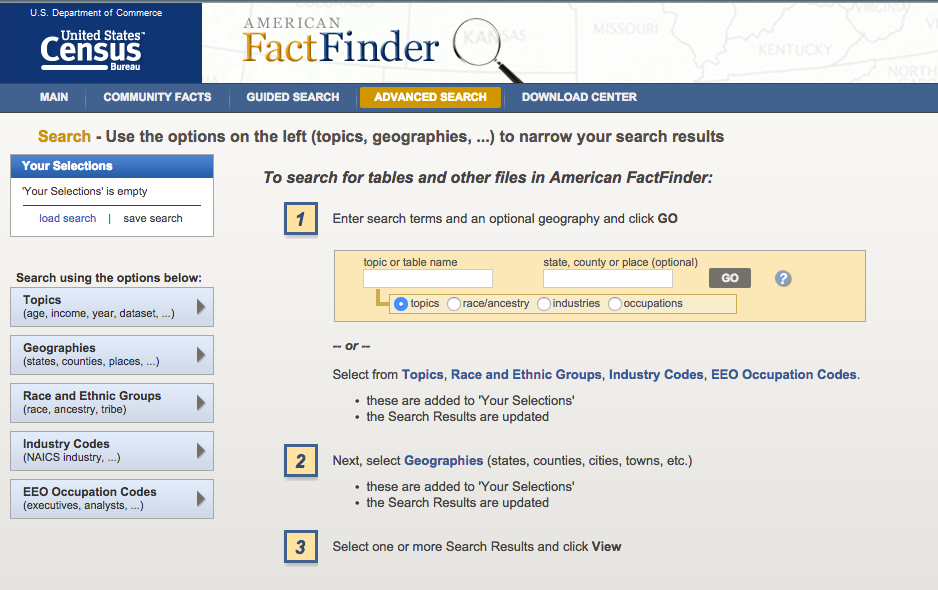
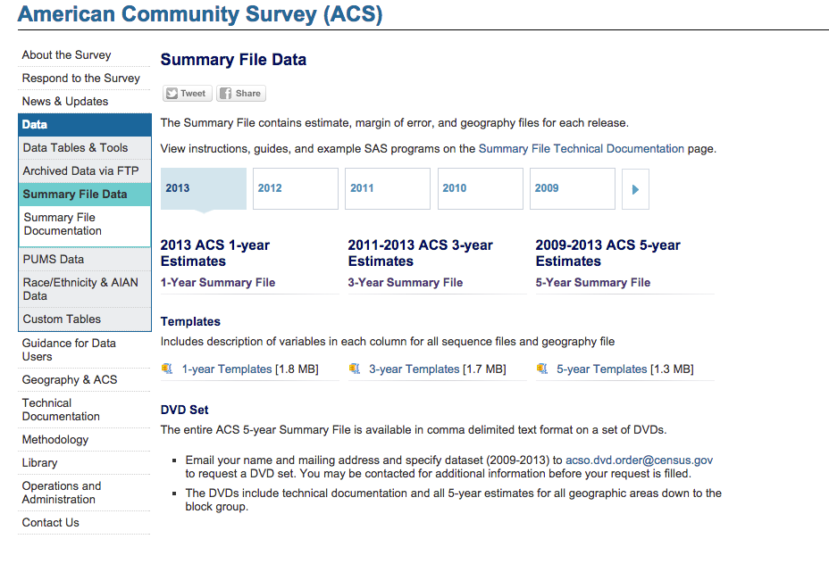
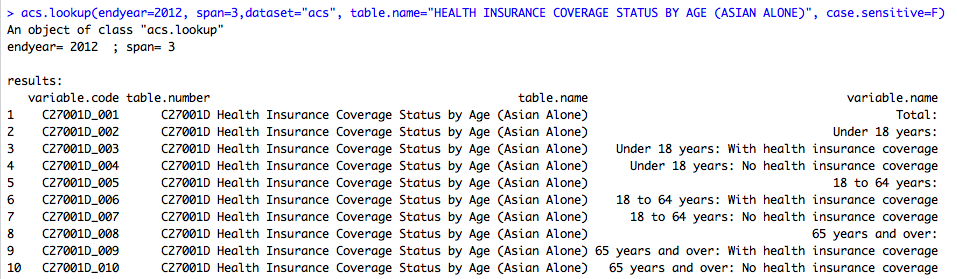
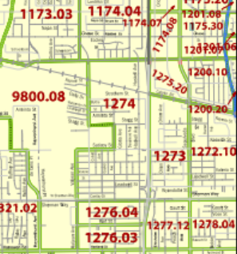

My "Writing Sample" 
========================================================
author: Tim Phan
date: 7/7/2014
font-family: 'Garamond'
Who am I?
========================================================

## I am a data analyst specializing in politics
- Political Science @ UCSB
- Worked in communications at a DC think tank specializing in economics and globalization
- Political Data @ Nationbuilder, worked on the national voter file

## My professional & personal aspirations
- Become more fluent in data science, statistics, and programming
- Carve out a meaningful niche in the city of LA as a go-between between tech and policy
- Be of service to my heritage and community, especially targetting younger Asian-Americans who want to get into policy and data.

========================================================

### I have a love-hate relationship with spreadsheets.

I started coding in grad school when my statistics professor forced us to use "R". I'd never heard of it before, but I was told it's a software platform similar to SPSS or STATA where we learned how to do various data analysis tasks.

Since then, I've learned that R is so much than that. Programming in R opened my eyes up to doing mundane tasks in creative and efficient ways, which enabled my classmates and coworkers to do their jobs a little bit easier. Data manipulation, extracting, cleaning, all those boring things you have to do in Excel, it actually became fun and manageable in R.

Let me show you what I can do with the American Census Survey in R.

========================================================

## The traditional way of accessing the ACS

<br>


========================================================

## Benefits of using the ACS API?
-The API lets developers customize Census Bureau statistics into web or mobile apps that provide users quick and easy access from an every increasing pool of publicly available datasets"- (http://www.census.gov/data/developers/about.html)

A MIT professor developed an open-source package in R (the "acs" package) which allows me to stream the ACS API directly into my workstation,

Now I can perform data analysis and visualizations without needing to actually download the data, as long as I know what I'm looking for.


========================================================
## Let's start with a real issue: Health Insurance


This is a choropleth chart looking at insurance coverage rates across the various California counties (darkest means more people are not covered). This data is collected from the ACS 2009 -- 2013 (5-Year Estimates) table B18135.


 

========================================================
It's a pretty picture, but it doesn't really help us. It looks like a population density map, and we don't really have any control over what happens in Fresno, San Diego, the Bay. But how can we can use data for more localized, actionable purposes?

AAAJ-LA has worked on community outreach programs to help educate the local API community about Obamacare, such as the Chinatown Library “Health Matters” Project.

Now I love Chinatown dim sum (and that Phoenix Bakery cake) as much as the next Asian, but what if we wanted to institute another program in the suburbs? For maximum impact, let's target a neighborhood with drastically lower rates of enrollment in health insurance. 


========================================================
#### Using the ACS package in R, we can lookup the appropriate table.



We'll filter rows 4, 7, and 10 (the Asians without coverage) and define a geographic area around Los Angeles and Orange County. By using census tracts as our geographic boundary, we'll be able to look deeper behind zip codes and citys. 

========================================================
Now we have a dataframe of nearly 3000 census tracts...

```
  census_tract      rate health_pop
1      1011.10 0.1792453        530
2      1011.22 0.2351695        472
3      1012.10 0.3176471        255
4      1012.20 0.2160000        250
5         1013 0.4537815        357
6         1014 0.3571429        350
```

and once we join it to the proper shapefiles, we get this...

========================================================


## Downtown LA

 


========================================================
## San Gabriel Valley
 


========================================================
## Orange County
 

========================================================
## Where should we prioritize our outreach then?

Let's run a filter for 75% off coverage, with at least 200 people.


```r
coverage.est %>% filter(percent > 0.75) %>% filter(pop > 200)
```

```
    county   percent pop     id
1  1201.06 0.8487085 542 120106
2  1277.12 0.7892562 242 127712
3  2122.02 0.7790262 801 212202
4  2123.05 0.8456973 337 212305
```

Now we can match up Census Tract 1201.06 with the maps here http://www.census.gov/geo/maps-data/maps/2010ref/st06_tract.html



========================================================
## Conclusions, and more questions...

It's not surprising to see less coverage rates in East LA, while the more affluent OC surburbs are doing quite well. This reflects larger socioeconomic trends such as education, employment, governance that can't be easily encompassed in one simple map. 

### Some potential avenues of research
- How does this map compare to other minorities (Latino, African-American) or whites? 
- Would these maps significantly change if we filtered it to working-age population (18-64 years old)?
- Can we run statistical tests and regression analysis on other datasets of the same time period? Say there is a college-educated person in the household, how much would that affect enrollment rates?

========================================================

## Thank you for reading this

I am looking to work with a service-oriented organization where I may apply my growing technical and data skills to things I truly care about. I want to work for an organization that challenges me to learn new things, and put me in a position to give back to a community here in Los Angeles. 

The first choropleth map reflects a growing value of mine, and that is to focus on more localized issues and politics in my community (rather than international and national politics that I was attracted to in my youth). I believe that AA-AJ could be the right organization for me to embrace that, and I would love to continue this conversation if you feel the same way. 

Please reach me at phan.timothyv@gmail.com, I hope to hear from you soon.
